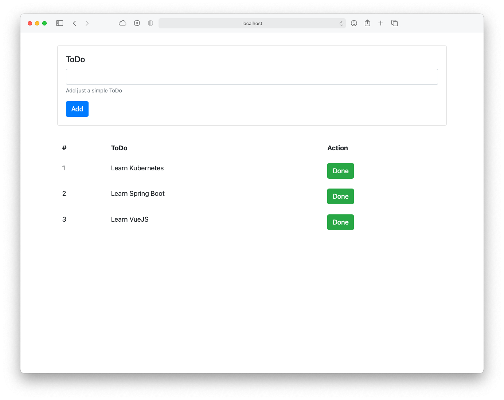
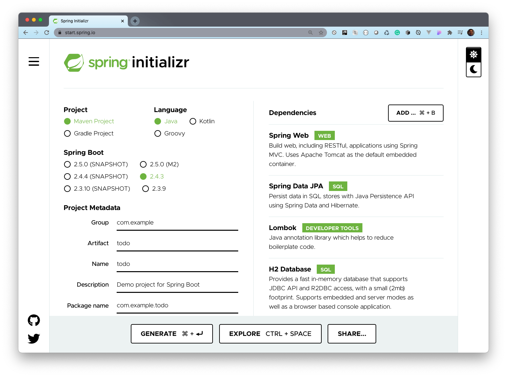

= Simple ToDo App with VueJS and Spring Boot
:icons: font

== VueJS UI

We are going to create a UI for the ToDo Service

. Create the Project and Insatll Axios
+
[source,shell]
----
vue init webpack todo-ui
cd todo-ui
npm install axios
----

. Add the Bootstrap CSS to the `index.html` file.
+
[source,html]
.index.html
----
include::todo-ui/index.html[]
----

. Create the `ToDo.vue` file with the following content:
+
[source,html]
.src/components/ToDo.vue
----
include::todo-ui/src/components/ToDo.vue[]
----

. Create the `ToDoList.vue` file with the following content:
+
[source,html]
.src/components/ToDo.vue
----
include::todo-ui/src/components/ToDoList.vue[]
----

. Create the `event-bus.js` file with the following content:
+
[source,javascript]
.src/utils/event-bus.js
----
include::todo-ui/src/utils/event-bus.js[]
----

. Add the `ROOT_API` variable to the `dev.env.js` and `prod.env.js`.
+
[source,javascript]
.config/dev.env.js
----
include::todo-ui/config/dev.env.js[]
----
+
[source,javascript]
.config/dev.env.js
----
include::todo-ui/config/prod.env.js[]
----

. Test you app with:
+
[source,shell]
npm run dev

. Create a `Dockerfile` witht eh following content
+
[source,dockerfile]
----
include::todo-ui/Dockerfile[]
----

. Build you image, test it and push it to your Registry.
+
[source,shell]
----
docker build -t <your-id>>/todo-ui:v1 .
docker run -it -p 8080:80 --rm --name todo-ui <your-id>/todo-ui:v1
docker push <your-id>>/todo-ui:v1
docker tag <image-id> <your-id>>/todo-ui:latest
docker push <your-id>>/todo-ui:latest
----

== Spring Boot

. Go to https://start.spring.io/[^]
+
Add the following Dependencies: _Web_, _Data JPA_, _H2_, _Lombok_, _MySQL Driver_
+

. Add the following classes/interface:
+
[source,java]
.src/main/java/com/example/todo/ToDo.java
----
include::todo/src/main/java/com/example/todo/ToDo.java[]
----
+
[source,java]
.src/main/java/com/example/todo/ToDoRepository.java
----
include::todo/src/main/java/com/example/todo/ToDoRepository.java[]
----
+
[source,java]
.src/main/java/com/example/todo/ToDoNotFoundException.java
----
include::todo/src/main/java/com/example/todo/ToDoNotfoundException.java[]
----
+
[source,java]
.src/main/java/com/example/todo/ToDoController.java
----
include::todo/src/main/java/com/example/todo/ToDoController.java[]
----

. Add the `data.sql` for initial data.
+
[source,sql]
.src/main/resources/data.sql
----
include::todo/src/main/resources/data.sql[]
----

. Add the following content to the `application.properties`
+
[source,properties]
.src/main/resources/application.properties
----
include::todo/src/main/resources/application.properties[]
----

. Add the `index.html` and `404.html pages`
+
[source,html]
.src/main/resources/static/index.html
----
include::todo/src/main/resources/static/index.html[]
----
+
[source,html]
.src/main/resources/static/error/404.html
----
include::todo/src/main/resources/static/error/404.html[]
----

. Test you app with:
+
[source,shell]
----
./mvnw spring-boot:run
----

. Create a Docker image, test and push it to the registry.
+
[source,shell]
----
./mvnw spring-boot:build-image -Dspring-boot.build-image.imageName=<your-id>/todo:v1
docker run -it -p 8081:8081 --rm --name todo <your-id>/todo:v1
docker push <your-id>>/todo:v1
docker tag <image-id> <your-id>>/todo:latest
docker push <your-id>>/todo:latest
----

== Deploy to OpenShift

. Open you account en IBM Cloud: https://ibm.biz/BdfsdZ[^]
. Go to your cluster.
. Deploy the `ToDo` app (the backend) with the following:
